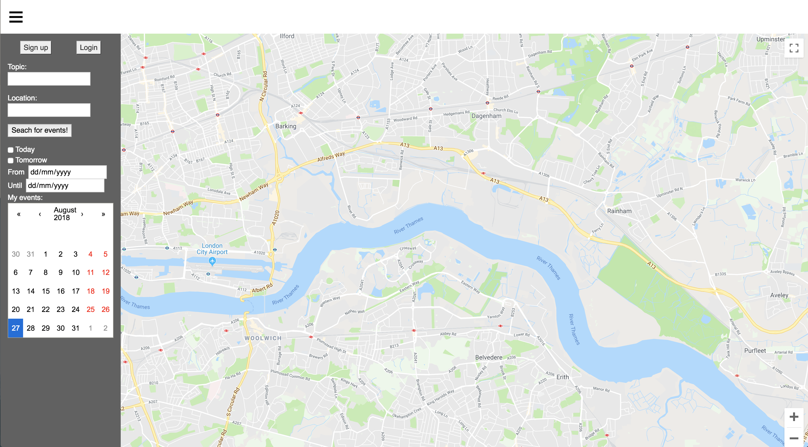

# git_together_frontend
Module 4 pair programming project: Meetup API

React-Rails app using the GoogleMaps and Meetup API. Allows users to securely sign up, sign in, search for events, add them to a personal list of saved events, clickthrough for details. 

